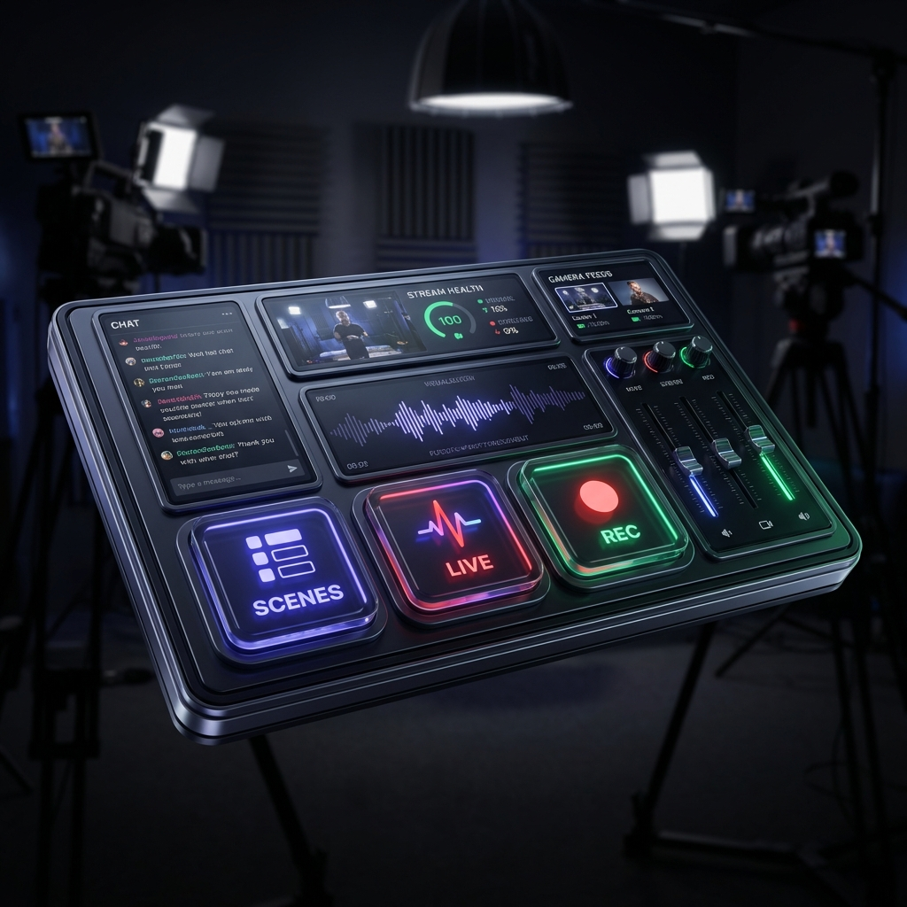

# 🎛️ Meld Studio Deck

A premium, customizable control interface designed specifically for **Meld Studio**. Take full command of your streaming and recording workflow with a sleek, high-performance dashboard.



## ✨ Features

- **🚀 Live Control Deck**: Pin your most-used scenes and controls for instant access.
- **🎬 Scene Management**: Seamlessly switch between scenes with real-time status feedback.
- **🔴 Stream & Record**: One-tap controls for starting/stopping your broadcast and recordings.
- **📊 System Health**: Monitor latency and streaming status at a glance.
- **📱 Responsive & Mini Sidebar**: Toggle between a full-featured sidebar and a condensed, space-saving view.
- **🌊 Glassmorphism UI**: A stunning, modern dark-mode aesthetic with smooth animations.

## 🛠️ Getting Started

### Prerequisites

- **Meld Studio**: Ensure Meld Studio is installed and running.
- **WebChannel API**: Enable the WebChannel API in Meld Studio settings (default port `13376`).

### Installation

1. Clone the repository:
   ```bash
   git clone https://github.com/your-username/meld-studio-deck.git
   cd meld-studio-deck
   ```

2. Install dependencies:
   ```bash
   npm install
   ```

3. Start the development server:
   ```bash
   npm run dev
   ```

## 🔌 Connection

The app connects to Meld Studio via local WebSocket (`127.0.0.1:13376`). If the connection is lost, you'll see a status indicator and a "Launch Connection" button to retry.

## 📚 Resources

- **Official WebChannel API Documentation**: [Meld Studio WebChannelAPI.md](https://github.com/MeldStudio/streamdeck/blob/main/WebChannelAPI.md) - Learn more about building tools for Meld Studio.

## 📦 Tech Stack

- **Vue 3** (Composition API)
- **TypeScript**
- **Vite**
- **Tailwind CSS 4**
- **Lucide Icons**

## 📄 License

MIT
